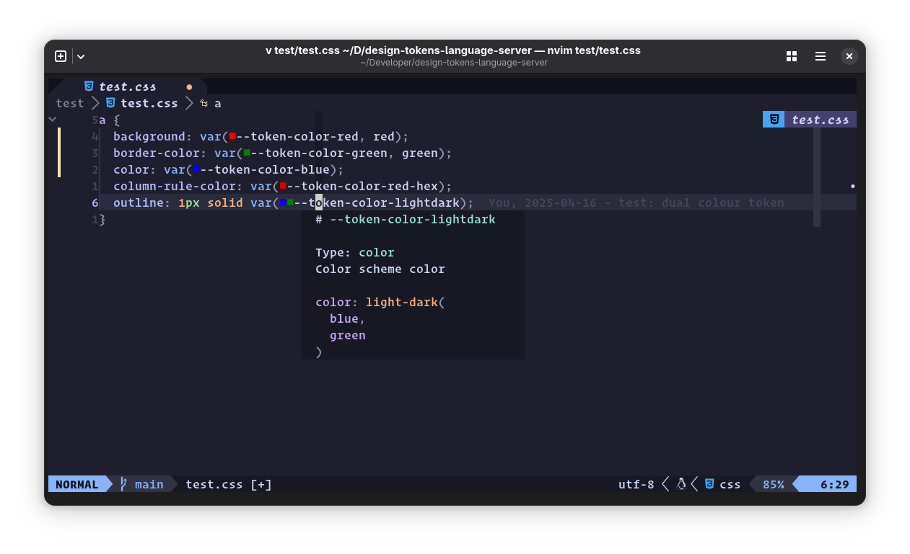
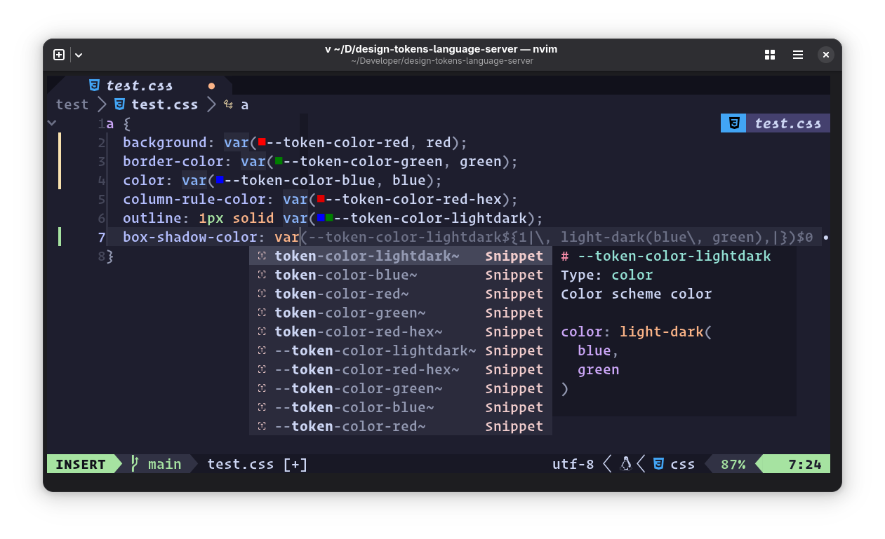
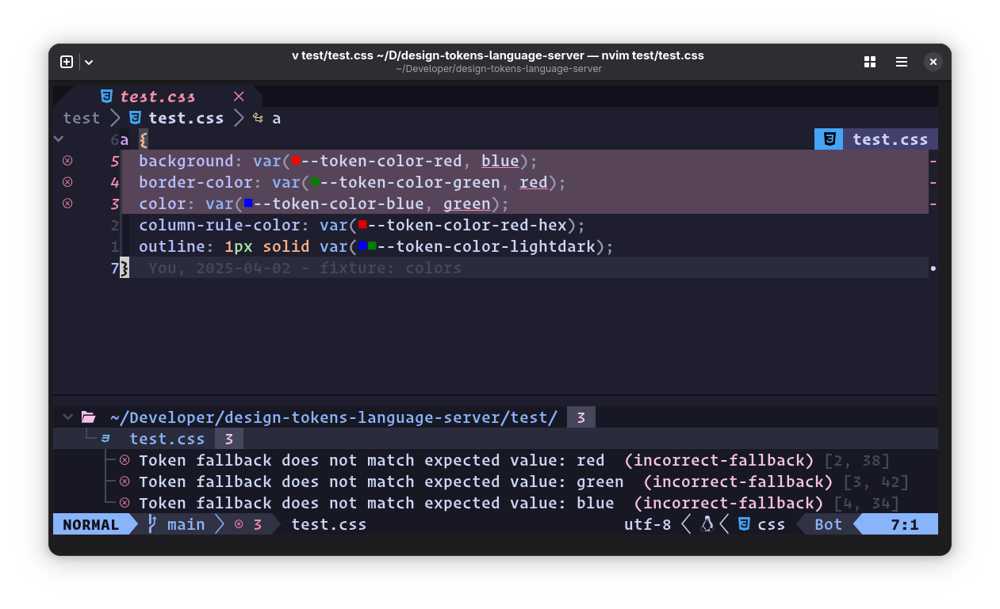
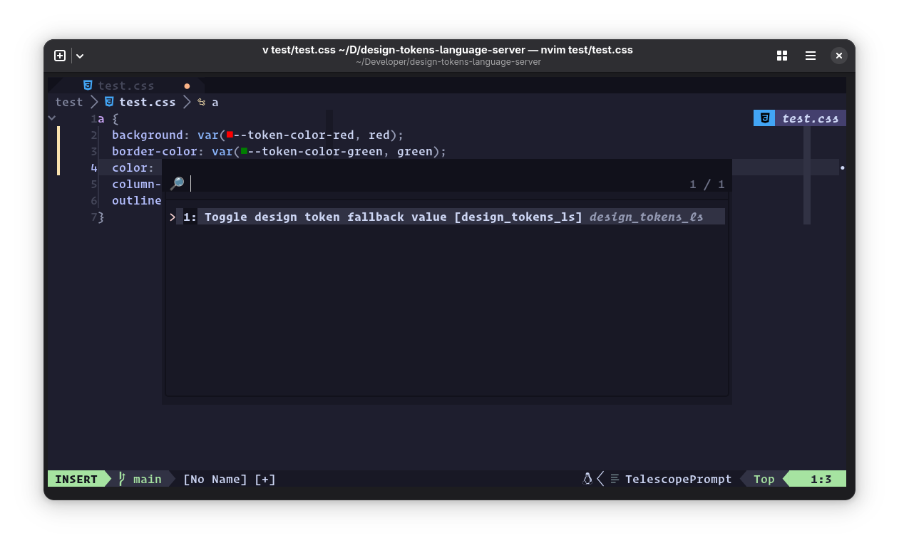
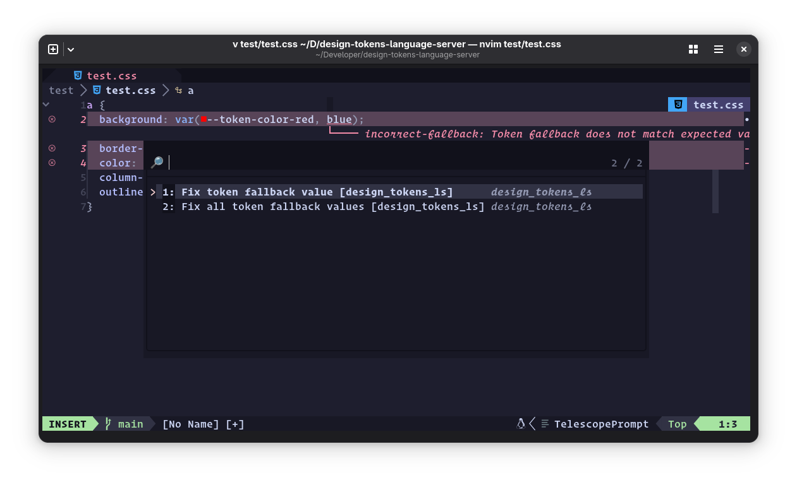
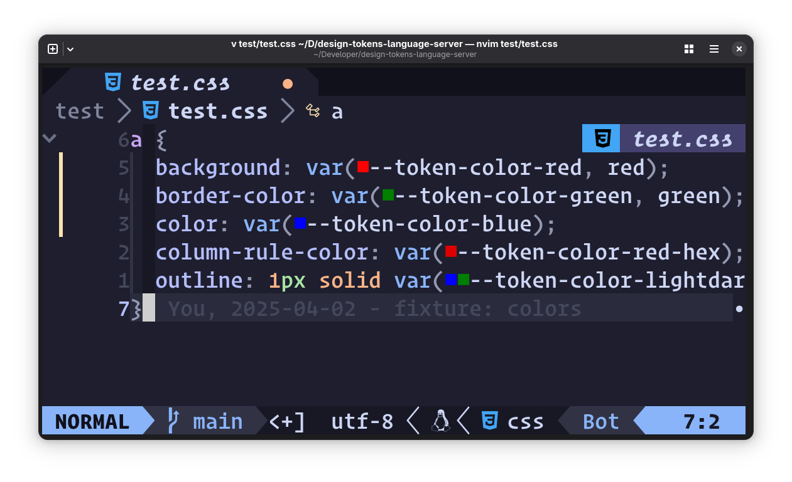
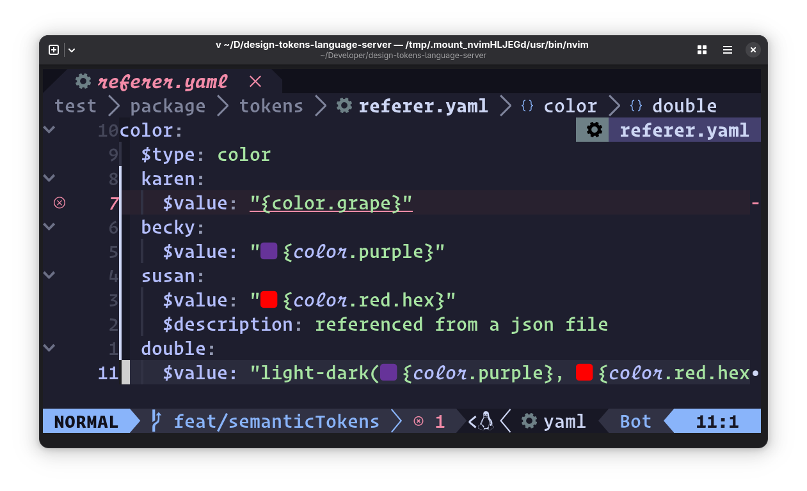
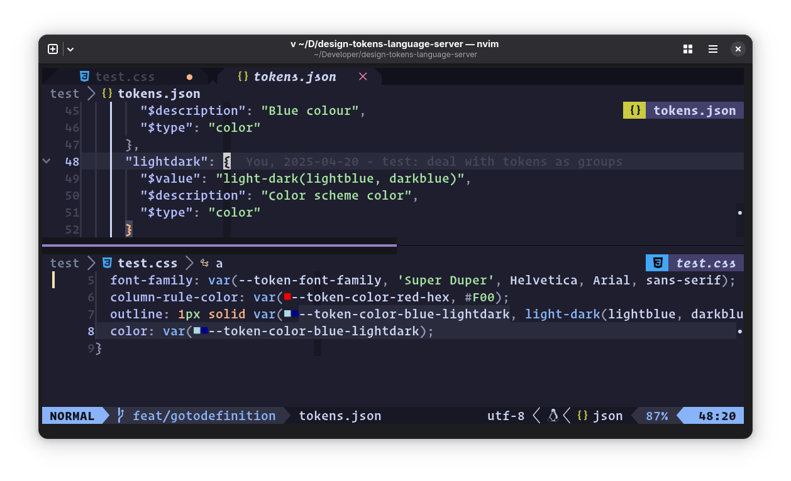
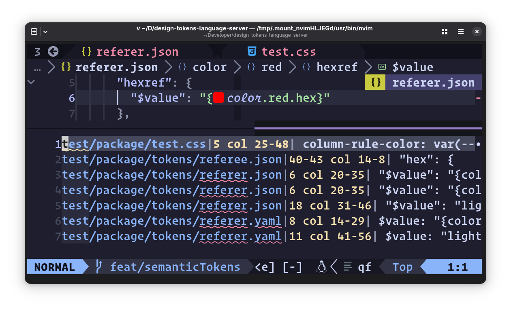

# Asimonim


[](https://codecov.io/gh/bennypowers/asimonim)

A high-performance design tokens parser, validator, and language server, available as a CLI tool and Go library.

> *Asimonim* (אֲסִימוֹנִים) (ahh-see-moh-NEEM) is Hebrew for "[tokens](https://www.wikiwand.com/en/articles/Telephone_token)".

Design systems use [design tokens][dtcg] to store visual primitives like colors, spacing, and typography. Asimonim parses and validates token files defined by the Design Tokens Community Group (DTCG) specification, supporting both the current draft and the stable V2025_10 schema.

## Features

- **Multi-schema support**: Handles both Draft and V2025_10 DTCG schemas
- **Automatic schema detection**: Duck-typing detection of schema version from file contents
- **Alias resolution**: Resolve token references with cycle detection
- **Multi-format export**: Convert tokens to TypeScript, SCSS, Swift, XML, and more
- **CSS output**: Generate CSS custom properties from tokens
- **Search**: Find tokens by name, value, or type with regex support
- **Validation**: Check files for schema compliance and circular references
- **Language Server**: Full LSP support for design tokens in your editor
- **MCP Server**: Model Context Protocol server for AI-assisted development

## Installation

### npm

```bash
npm install -g @pwrs/asimonim
```

### Gentoo Linux

Enable the `bennypowers` overlay, then install:

```bash
eselect repository enable bennypowers
emaint sync -r bennypowers
emerge dev-util/asimonim
```

### From Source

```bash
go install bennypowers.dev/asimonim@latest
```

## Quick Start

Validate your design token files:

```bash
# Validate token files
asimonim validate tokens.json

# List all tokens
asimonim list tokens.json

# Output as CSS custom properties
asimonim list tokens.json --format css

# Search for color tokens
asimonim search "primary" tokens.json --type color
```

## Editor Integration

Asimonim includes a built-in language server (`asimonim lsp`) with editor
extensions for VS Code, Zed, and Claude Code.

### VS Code

Install [Design Tokens Language Server][vscode-ext] from the VS Code Marketplace.

### Zed

Install [design-tokens][zed-ext] from the Zed extension registry.

### Claude Code

Asimonim is available as a [Claude Code plugin][claude-plugin].

### Neovim

Using native Neovim LSP (see [`:help lsp`][neovimlspdocs] for more info):

Create a file like `~/.config/nvim/lsp/asimonim.lua`:

```lua
---@type vim.lsp.ClientConfig
return {
  cmd = { 'asimonim', 'lsp' },
  root_markers = { '.git', 'package.json' },
  filetypes = { 'css', 'html', 'twig', 'php', 'javascript', 'javascriptreact', 'typescript', 'typescriptreact', 'json', 'yaml' },
  settings = {
    dtls = {
      tokensFiles = {
        {
          path = "~/path/to/tokens.json",
          prefix = "my-ds",
        },
      },
      groupMarkers = { '_', '@', 'DEFAULT' },
    }
  },
  on_attach = function(client, bufnr)
    if vim.lsp.document_color then
      vim.lsp.document_color.enable(true, bufnr, {
        style = 'virtual'
      })
    end
  end,
}
```

> [!TIP]
> If your tokens are in `node_modules` (e.g., `npm:@my-ds/tokens/tokens.json`),
> the default `root_markers` may find the wrong `package.json`. The example
> above uses `{ '.git', 'package.json' }` which prefers `.git` over nested
> `package.json` files.
>
> For non-git projects or monorepos, use a custom `root_dir` that explicitly
> skips `node_modules`:
>
> ```lua
> root_dir = function(bufnr, on_dir)
>   local root = vim.fs.root(bufnr, function(name, path)
>     if name == 'package.json' and not path:match('node_modules') then
>       return true
>     end
>     return name == '.git'
>   end)
>   if root then on_dir(root) end
> end,
> ```

### Other Editors

Any editor with LSP support can use Asimonim. Run `asimonim lsp` as the
language server command, with document selectors for CSS, HTML, Twig, PHP,
JavaScript, TypeScript, JSON, and YAML.

## Language Server Features

The language server extracts CSS from `<style>` blocks and `style=""`
attributes in HTML, as well as HTML embedded in languages like PHP or in
tagged template literals in JavaScript and TypeScript. All LSP features
below work across these contexts.

### Hover Docs

Display markdown-formatted token descriptions and value when hovering over token
names.



### Snippets

Auto complete for design tokens — get code snippets for token values with
optional fallbacks.



### Diagnostics

Warns when your stylesheet contains a `var()` call for a design token,
but the fallback value doesn't match the token's pre-defined `$value`.



### Code Actions

Toggle the presence of a token `var()` call's fallback value. Offers to fix
wrong token definitions in diagnostics.




### Document Color

Display token color values in your source, e.g. as swatches.



### Semantic Tokens

Highlight token references inside token definition files.



### Go to Definition

Jump to the position in the tokens file where the token is defined. Can also
jump from a token reference in a JSON file to the token's definition.



Go to definition in a split window using Neovim's [`<C-w C-]>` binding][cwcdash],
which defers to LSP methods when they're available.

### References

Locate all references to a token in open files, whether in CSS or in the token
definition JSON or YAML files.



## Schema Support

Asimonim supports both DTCG schema versions:

- **[Editor's Draft][editorsdraft]** — Original DTCG format
  - String color values (hex, rgb, hsl, named colors)
  - Curly brace references: `{color.brand.primary}`
  - Group markers for root tokens: `_`, `@`, `DEFAULT`

- **[2025.10 Stable][202510stable]** — Latest stable specification
  - Structured color values with 14 color spaces (sRGB, oklch, display-p3, etc.)
  - JSON Pointer references: `$ref: "#/color/brand/primary"`
  - Group inheritance: `$extends: "#/baseColors"`
  - Standardized `$root` token for root-level tokens
  - All draft features (backward compatible)

### Multi-Schema Workspaces

Asimonim can load multiple token files with different schema versions simultaneously:

```json
{
  "designTokensLanguageServer": {
    "tokensFiles": [
      "legacy/draft-tokens.json",
      "design-system/tokens.json"
    ]
  }
}
```

Schema version detection priority:
1. `$schema` field in the token file (recommended)
2. Per-file `schemaVersion` config in `package.json`
3. Duck-typing based on features (structured colors, `$ref`, `$extends`)
4. Defaults to Editor's Draft for ambiguous files

## CLI Reference

### `asimonim validate`

Validate design token files for correctness and schema compliance.

```
Usage:
  asimonim validate [files...]

Flags:
  -s, --schema string    Force schema version (draft, v2025.10)
      --strict           Fail on warnings
      --quiet            Only output errors
```

**Examples:**

```bash
# Validate multiple files
asimonim validate colors.json spacing.json typography.json

# Force a specific schema version
asimonim validate tokens.json --schema v2025.10

# Quiet mode for CI
asimonim validate tokens.json --quiet
```

### `asimonim list`

List all tokens from design token files with optional filtering and formatting.

```
Usage:
  asimonim list [files...]

Flags:
  -s, --schema string    Force schema version (draft, v2025.10)
      --type string      Filter by token type
      --resolved         Show resolved values (follow aliases)
      --format string    Output format: table, json, css (default "table")
      --css              Shorthand for --format css
```

**Examples:**

```bash
# List all tokens as a table
asimonim list tokens.json

# Output as JSON
asimonim list tokens.json --format json

# Generate CSS custom properties
asimonim list tokens.json --format css

# Show only color tokens with resolved values
asimonim list tokens.json --type color --resolved
```

### `asimonim search`

Search design tokens by name, value, or type.

```
Usage:
  asimonim search <query> [files...]

Flags:
  -s, --schema string    Force schema version (draft, v2025.10)
      --name             Search names only
      --value            Search values only
      --type string      Filter by token type
      --regex            Treat query as a regular expression
      --format string    Output format: table, json, names (default "table")
```

**Examples:**

```bash
# Search by name or value
asimonim search "blue" tokens.json

# Search names only with regex
asimonim search "^color\." tokens.json --name --regex

# Find all dimension tokens containing "spacing"
asimonim search "spacing" tokens.json --type dimension

# Output matching token names only
asimonim search "primary" tokens.json --format names
```

### `asimonim convert`

Convert and combine DTCG token files between formats.

```
Usage:
  asimonim convert [files...]

Flags:
  -o, --output string      Output file (default: stdout)
  -f, --format string      Output format (default "dtcg")
  -p, --prefix string      Prefix for output variable names
      --flatten            Flatten to shallow structure (dtcg/json formats only)
  -d, --delimiter string   Delimiter for flattened keys (default "-")
  -s, --schema string      Force output schema version (draft, v2025.10)
  -i, --in-place           Overwrite input files with converted output
```

**Output Formats:**

| Format       | Extension          | Description                                        |
| ------------ | ------------------ | -------------------------------------------------- |
| `dtcg`       | `.json`            | DTCG-compliant JSON (default)                      |
| `json`       | `.json`            | Flat key-value JSON                                |
| `android`    | `.xml`             | Android-style XML resources                        |
| `swift`      | `.swift`           | iOS Swift constants with native SwiftUI Color      |
| `js`         | `.ts`, `.js`, `.cts`, `.cjs` | JavaScript/TypeScript (see JS options below) |
| `scss`       | `.scss`            | SCSS variables with kebab-case names               |
| `css`        | `.css`             | CSS custom properties                              |
| `snippets`   | `.code-snippets`, `.tmSnippet`, `.json` | Editor snippets (VSCode, TextMate, or Zed) |

**JS Format Options:**

| Flag           | Values                | Default   | Description                              |
| -------------- | --------------------- | --------- | ---------------------------------------- |
| `--js-module`  | `esm`, `cjs`          | `esm`     | Module system (ESM or CommonJS)          |
| `--js-types`   | `ts`, `jsdoc`         | `ts`      | Type system (TypeScript or JSDoc)        |
| `--js-export`  | `values`, `map`       | `values`  | Export form (simple values or TokenMap)  |

**Examples:**

```bash
# Flatten tokens to shallow structure
asimonim convert --flatten tokens/*.yaml -o flat.json

# Convert from Editor's Draft to v2025.10 (stable)
asimonim convert --schema v2025.10 tokens.yaml -o stable.json

# In-place schema conversion
asimonim convert --in-place --schema v2025.10 tokens/*.yaml

# Combine multiple files
asimonim convert colors.yaml spacing.yaml -o combined.json

# Generate TypeScript ESM module (default JS output)
asimonim convert --format js -o tokens.ts tokens/*.yaml

# Generate TypeScript CommonJS module
asimonim convert --format js --js-module cjs -o tokens.cts tokens/*.yaml

# Generate JavaScript with JSDoc types
asimonim convert --format js --js-types jsdoc -o tokens.js tokens/*.yaml

# Generate TokenMap class for typed token access
asimonim convert --format js --js-export map -o tokens.ts tokens/*.yaml

# Generate SCSS variables with prefix
asimonim convert --format scss --prefix rh -o _tokens.scss tokens/*.yaml

# Generate Android XML resources
asimonim convert --format android -o values/tokens.xml tokens/*.yaml

# Generate iOS Swift constants
asimonim convert --format swift -o DesignTokens.swift tokens/*.yaml

# Generate CSS custom properties
asimonim convert --format css -o tokens.css tokens/*.yaml

# Generate CSS with :host selector (for shadow DOM)
asimonim convert --format css --css-selector :host -o tokens.css tokens/*.yaml

# Generate Lit CSS module
asimonim convert --format css --css-module lit -o tokens.css.ts tokens/*.yaml

# Generate VSCode snippets
asimonim convert --format snippets -o tokens.code-snippets tokens/*.yaml

# Generate TextMate snippets
asimonim convert --format snippets --snippet-type textmate -o tokens.tmSnippet tokens/*.yaml

# Generate Zed editor snippets
asimonim convert --format snippets --snippet-type zed -o css.json tokens/*.yaml
```

### `asimonim mcp`

Launch a Model Context Protocol (MCP) server for AI-assisted development with
design tokens. The server communicates over stdin/stdout using JSON-RPC.

```text
Usage:
  asimonim mcp
```

The MCP server discovers tokens from:
- Local token files specified in `.config/design-tokens.yaml`
- npm/jsr dependencies with `designTokens` field or export condition
- Resolver documents referenced in config

**Tools:**

| Tool | Description |
| ---- | ----------- |
| `validate_tokens` | Validate token files for correctness, detect circular references, report deprecated tokens |
| `search_tokens` | Search tokens by name, value, description, or type with regex support |
| `convert_tokens` | Convert tokens to CSS, SCSS, JavaScript, Swift, Android XML, or other formats |

**Resources:**

| URI | Description |
| --- | ----------- |
| `asimonim://tokens` | List available token sources with counts |
| `asimonim://tokens/{source}` | All tokens from a specific source |
| `asimonim://token/{source}/{path}` | Individual token detail |
| `asimonim://config` | Workspace configuration |

**Example (Claude Code `settings.json`):**

```json
{
  "mcpServers": {
    "asimonim": {
      "command": "asimonim",
      "args": ["mcp"]
    }
  }
}
```

### `asimonim lsp`

Start the language server for editor integration.

```
Usage:
  asimonim lsp
```

The LSP server communicates over stdin/stdout using JSON-RPC. It is typically
launched by an editor extension rather than manually.

### `asimonim version`

Display version information.

```
Usage:
  asimonim version

Flags:
      --format string    Output format: text, json (default "text")
```

## Configuration

Asimonim reads configuration from `.config/design-tokens.{yaml,yml,json}`:

```yaml
# .config/design-tokens.yaml
prefix: "rh"
resolvers:
  - ./tokens.resolver.json
  - npm:@acme/tokens/tokens.resolver.json
files:
  - ./tokens.json
  - ./tokens/**/*.yaml
  - path: npm:@rhds/tokens/json/rhds.tokens.json
    prefix: rh
groupMarkers: ["_", "@", "DEFAULT"]
schema: draft
cdn: unpkg  # CDN for network fallback (unpkg, esm.sh, esm.run, jspm, jsdelivr)
```

When running commands without file arguments, files from config are used:

```bash
asimonim list      # Uses files from config
asimonim validate  # Uses files from config
```

The language server also reads from `package.json`:

```json
{
  "designTokensLanguageServer": {
    "prefix": "my-ds",
    "tokensFiles": [
      "npm:@my-design-system/tokens/tokens.json",
      {
        "path": "npm:@his-design-system/tokens/tokens.json",
        "prefix": "his-ds",
        "groupMarkers": ["GROUP"]
      },
      {
        "path": "./docs/docs-site-tokens.json",
        "prefix": "docs-site"
      }
    ]
  }
}
```

### Resolvers

The `resolvers` field accepts [DTCG resolver documents](https://www.designtokens.org/tr/2025.10/resolver/) — JSON files that declare how to compose multiple token files via sets, modifiers, and resolution order. Each entry can be a local path (relative or absolute) or an `npm:`/`jsr:` package specifier.

Resolver documents are distinct from token files — they reference and orchestrate token files rather than containing tokens directly.

#### Auto-Discovery

`DiscoverResolvers` scans the project's root `package.json` and inspects each direct dependency (the `dependencies` map) for resolver files. Only direct dependencies are checked — `devDependencies`, `peerDependencies`, and transitive dependencies are not scanned.

Dependencies are processed in sorted order for deterministic results. Each dependency's `package.json` is checked for a resolver declaration using either:

**`designTokens` field** (recommended, checked first):
```json
{
  "name": "@acme/tokens",
  "designTokens": {
    "resolver": "tokens.resolver.json"
  }
}
```

**`designTokens` export condition** (fallback):
```json
{
  "name": "@acme/tokens",
  "exports": {
    ".": {
      "designTokens": "./tokens.resolver.json",
      "import": "./dist/index.js"
    }
  }
}
```

When both are present, the `designTokens` field takes priority over the export condition.

### Network Fallback

When using `npm:` specifiers for token packages, Asimonim normally resolves them
from `node_modules`. If the package isn't installed locally, you can enable
**network fallback** to fetch tokens from a CDN (default:
[unpkg.com](https://unpkg.com), configurable via the `cdn` option).

This is opt-in and disabled by default.

#### Enable in package.json

```json
{
  "designTokensLanguageServer": {
    "networkFallback": true,
    "networkTimeout": 30,
    "cdn": "unpkg",
    "tokensFiles": [
      "npm:@my-design-system/tokens/tokens.json"
    ]
  }
}
```

#### Options

| Option | Type | Default | Description |
|--------|------|---------|-------------|
| `networkFallback` | `boolean` | `false` | Enable CDN fallback for package specifiers |
| `networkTimeout` | `number` | `30` | Max seconds to wait for CDN requests |
| `cdn` | `string` | `"unpkg"` | CDN provider: `unpkg`, `esm.sh`, `esm.run`, `jspm`, `jsdelivr` |

#### Security

- Network fallback is **opt-in** — it never fetches from the network unless
  explicitly enabled
- Responses are limited to 10 MB to prevent resource exhaustion
- Requests have a configurable timeout (default 30 seconds)
- Only `npm:` specifiers with a file component trigger CDN lookups

### Token Prefixes

The DTCG format does not require a prefix for tokens, but it is recommended to
use a prefix to avoid conflicts with other design systems. If your token files
do not nest all of their tokens under a common prefix, you can pass one yourself
in the `prefix` property of the token file object.

### Group Markers

> [!IMPORTANT]
> Group markers are **only used with Editor's Draft schema**. The 2025.10 stable
> specification uses the standardized `$root` reserved token name instead.

The `groupMarkers` option works around the DTCG draft schema's lack of a
built-in way for a token to also act as a group. For example, with
`groupMarkers: ["_"]`:

```json
{
  "color": {
    "red": {
      "_": {
        "$value": "#FF0000",
        "$description": "Red color"
      },
      "darker": {
        "$value": "#AA0000",
        "$description": "Darker red color"
      }
    }
  }
}
```

This creates tokens: `--color-red` and `--color-red-darker`.

The v2025.10 stable schema uses `$root` instead, so `groupMarkers` is ignored
for that schema version.

## CSS Output

The `css` format generates CSS custom properties from tokens:

```bash
asimonim convert --format css -o tokens.css tokens/*.yaml
```

**Options:**

| Flag             | Default  | Description                                      |
| ---------------- | -------- | ------------------------------------------------ |
| `--css-selector` | `:root`  | CSS selector wrapping properties (`:root`, `:host`) |
| `--css-module`   | (none)   | JavaScript module wrapper (`lit` for Lit CSS)   |

**Examples:**

```bash
# Shadow DOM components
asimonim convert --format css --css-selector :host -o tokens.css tokens/*.yaml

# Lit CSS tagged template literal
asimonim convert --format css --css-module lit -o tokens.css.ts tokens/*.yaml
```

## Editor Snippets

The `snippets` format generates editor snippets for autocompleting CSS custom properties:

```bash
asimonim convert --format snippets -o tokens.code-snippets tokens/*.yaml
```

**Snippet Types:**

| Type       | Extension         | Description                              |
| ---------- | ----------------- | ---------------------------------------- |
| `vscode`   | `.code-snippets`  | VSCode/compatible editors (default)      |
| `textmate` | `.tmSnippet`      | TextMate/Sublime Text plist format       |
| `zed`      | `.json`           | Zed editor snippets                      |

Use `--snippet-type` to select the output format:

```bash
# VSCode snippets (default)
asimonim convert --format snippets -o tokens.code-snippets tokens/*.yaml

# TextMate snippets
asimonim convert --format snippets --snippet-type textmate -o tokens.tmSnippet tokens/*.yaml

# Zed editor snippets
asimonim convert --format snippets --snippet-type zed -o css.json tokens/*.yaml
```

## Schema Versions

Asimonim supports multiple DTCG schema versions:

| Version   | References                         | Colors     | Features                    |
| --------- | ---------------------------------- | ---------- | --------------------------- |
| Draft     | `{token.path}`                     | Strings    | Group markers               |
| v2025.10  | `{token.path}` or `$ref: "#/path"` | Structured | `$extends`, `$root`         |

Schema version is automatically detected from file contents, or can be forced with the `--schema` flag.

## Contributing

See [CONTRIBUTING.md][contributingmd]

## License

GPLv3

[dtcg]: https://design-tokens.github.io/community-group/format/
[contributingmd]: ./CONTRIBUTING.md
[neovimlspdocs]: https://neovim.io/doc/user/lsp.html
[cwcdash]: https://neovim.io/doc/user/windows.html#CTRL-W_g_CTRL-%5D
[editorsdraft]: https://second-editors-draft.tr.designtokens.org/format/
[202510stable]: https://www.designtokens.org/tr/2025.10/
[vscode-ext]: https://marketplace.visualstudio.com/items?itemName=pwrs.design-tokens-language-server-vscode
[zed-ext]: https://zed.dev/extensions/design-tokens
[claude-plugin]: https://github.com/bennypowers/asimonim
